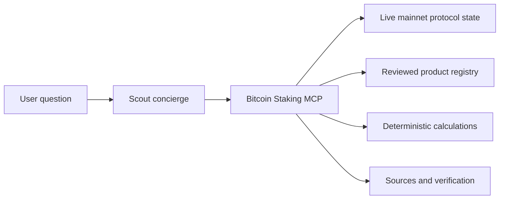

# Scout — the Bitcoin Staking Concierge

Scout helps people find the right Bitcoin Staking path, understand the tradeoffs, and prepare to participate using current mainnet evidence.

Ask a question in plain language. Scout checks live protocol state, reviewed product records, custody evidence, and sourced terms before it answers. It shows where the information came from, when it was verified, and what still needs confirmation.

Scout is powered by the Bitcoin Staking MCP, a read-only intelligence layer for Bitcoin Staking on Stacks. It can research, compare, explain, and calculate. It cannot construct, sign, or broadcast a transaction.

[Try Scout](#quick-start) · [See how it works](#see-how-it-works) · [Technical documentation](#technical-documentation)

## What Scout helps you do

- **Find current and upcoming opportunities.** See what is open, what is scheduled, and what you can prepare for now.
- **Compare ways to participate.** Understand how each path affects custody, liquidity, eligibility, and the asset you hold.
- **Understand rewards and risks.** Review sourced economics, lockups, fees, security controls, recovery paths, and missing evidence.
- **Build a participation plan.** Move from a broad goal to a practical route, compatible wallet or custodian, and verified next step.

Scout keeps the experience conversational. Users do not need to learn the underlying tool catalog or translate protocol fields themselves.

## See how it works

A typical conversation moves from discovery to a concrete next step. Scout refreshes the relevant evidence at each stage.

1. **“When is the next bond?”**

   Scout checks live mainnet protocol state and current product records, then explains what is open or coming next in ordinary language. If timing is estimated from chain data, Scout labels it as an estimate.

2. **“How can I participate?”**

   Scout compares the direct native-L1 and current pool-based routes. It starts with the outcome that matters to the user: keeping Bitcoin on L1, retaining key control, or using a staked position for liquidity and other financial activity. Pool operators, required assets, and integrations come from current evidence rather than static copy.

3. **“Does my wallet or custodian work?”**

   Scout checks the maintained custody directory for product-level support. When a bond has been selected, it checks exact bond compatibility separately. General wallet support is not treated as proof that every bond-specific flow is ready.

4. **“What are the risks?”**

   Scout explains the Bitcoin-enforced lock and recovery conditions first, then the audits and transaction checks a participant can verify. It closes with the implementation and operational risks that remain, such as using the wrong key, signing an incorrect transaction, or losing recovery information.

5. **“Where do I get started?”**

   Once the user chooses a route, Scout re-checks the current access record and gives one verified next step. An interest form or Bitcoin transfer alone is not presented as proof that enrollment is complete.

The same journey works for a short question or a detailed profile. A user can start with an amount, wallet, custodian, liquidity requirement, or security concern and go directly to the relevant step.

## Quick start

Scout requires Node 22. Install it for Codex and Claude Code from any directory:

```bash
npx -y github:andre-stacks/bitcoin-staking-mcp#v0.5.1 setup
```

The installer starts the packaged server, performs an MCP handshake, registers the server in the available hosts, and installs the Codex concierge skill. Restart Codex and Claude Code after setup so they reload the MCP and skill metadata.

Open Scout in Codex:

```text
$bitcoin-staking-concierge
```

Or open the concierge prompt in Claude Code:

```text
/mcp__bitcoin_staking__bitcoin_staking_concierge
```

Try asking:

```text
When is the next bond launching?
How can I get started staking?
Which participation option is right for me?
```

Any non-empty request goes directly to that workflow. An empty invocation introduces Scout once, summarizes what it can help with, and offers useful starting points.

Verify the installation at any time:

```bash
npx -y github:andre-stacks/bitcoin-staking-mcp#v0.5.1 check
```

Use `--hosts codex` or `--hosts claude` to install only one host. See the [installation guide](docs/INSTALLATION.md) for local-checkout, pinned-source, JSON, update, and uninstall options.

## Why users can trust the answer

Scout is built for mainnet. It starts with the best currently available data and applies a clear evidence order before presenting an opportunity or recommendation.

| Evidence | What it means |
| --- | --- |
| `live` | A current public mainnet chain or API observation. |
| `published` | An official document or owner-reviewed product record. |
| `derived` | A deterministic calculation or assessment built from sourced inputs. |

Product claims are checked independently. Protocol activation does not establish that a bond is open. A supported custody path does not establish exact compatibility with every bond. A published rate or duration does not establish final on-chain configuration. Scout keeps those questions separate so the conclusion matches the evidence.

Every factual response can carry source records and verification times. When the available corpus cannot support a claim about availability, yield, compatibility, or security, Scout identifies what is missing. Deterministic calculations require sourced or user-supplied inputs, and an unpublished fee is never assumed to be zero.

This makes the workflow suitable for a mainnet product: the same read-only tools can support discovery, diligence, route selection, and preparation while the wallet or custodian remains responsible for approvals and signing. Current availability is always determined from current evidence; the README does not imply that enrollment is open.

## For developers



Scout is the conversational workflow over the MCP. The intelligence core owns schemas, source precedence, registry freshness, compatibility checks, economics, and recommendation rules. The core has no LLM dependency, so any MCP client can reuse the same structured facts and calculations.

Fifteen read-only MCP tools support the single Scout experience. The repository also ships an stdio server, portable setup and verification commands, a Codex skill, a Claude Code prompt, versioned data contracts, and a protected registry console for reviewed product facts. The `bitcoin-staking://capabilities` resource maps user goals to the tools and reports the server, contract, skill, and registry versions.

For repository development:

```bash
npm ci
npm run check
npm run test:live
```

The default release gate is offline and checks types, registry contracts, the build, MCP behavior, installer integrity, and the registry console. `npm run test:live` is an opt-in read of current public mainnet protocol state.

## Technical documentation

- [Installation and host configuration](docs/INSTALLATION.md)
- [Architecture, interfaces, and tool catalog](docs/TECHNICAL_SPEC.md)
- [Registry console and publication model](docs/REGISTRY_CONSOLE.md)
- [Security question catalog](docs/SECURITY_QUESTION_CATALOG.md)
- [Canonical source corpus](docs/SOURCE_CORPUS.md)
- [Product requirements](docs/PRODUCT_REQUIREMENTS.md)

## Safety boundary

Scout is informational software, not financial advice. Verify the opportunity, custody path, economic terms, and transaction details through their authoritative sources before committing capital.
