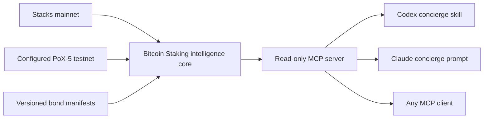

# Bitcoin Staking MCP

The agent-readable interface for discovering, understanding, and planning native Bitcoin staking on Stacks.

Bitcoin Staking MCP combines live mainnet and testnet PoX state, on-chain protocol-bond discovery, versioned bond manifests, deterministic yield scenarios, sourced security diligence, compatibility evidence, and a goal-first concierge. It is intentionally read-only: it cannot construct, sign, or broadcast transactions.

## Why this exists

Bitcoin staking crosses Bitcoin L1, Stacks, wallets, custodians, economic assumptions, and product-specific enrollment rules. Agents need structured facts and explicit uncertainty—not another generic FAQ bot.

This server keeps four kinds of information separate:

- `live`: current chain or API state;
- `published`: public documentation or product metadata;
- `derived`: deterministic calculations or fit assessments;
- `demo`: synthetic hackathon data that is never presented as available capital infrastructure.

## Architecture



The intelligence core contains schemas, provenance, economics, compatibility, and recommendation rules. It has no LLM dependency. The concierge is a thin workflow over MCP tools, not a separate service.

The concierge uses an institutional diligence voice: decision-first for CFO and investment audiences, mechanism-first for technical and custody teams, neutral rather than promotional, and explicit about uncertainty and the next verification step.

The answer policy is evidence-gated. The concierge may use only current MCP structured output and MCP resources for factual claims. It does not complete missing answers from model memory, infer wallet support from protocol behavior, treat an audit statement as end-to-end wallet proof, or substitute demo data after a live-read failure. When the corpus cannot answer a question, it says: “This MCP does not currently verify that,” and identifies the missing evidence.

## Quick start

Requires Node 22.

Install for both Codex and Claude Code from any directory:

```bash
npx -y github:andre-stacks/bitcoin-staking-mcp setup
```

The installer performs a real MCP handshake, registers `bitcoin-staking` in the user-level configuration for both hosts, installs the global Codex concierge skill, and prints the first prompts. Restart both hosts after setup, then verify at any time:

```bash
npx -y github:andre-stacks/bitcoin-staking-mcp check
```

To install only one host, use `--hosts codex` or `--hosts claude`. See [Installation](docs/INSTALLATION.md) for local-checkout, pinned-source, JSON, update, and uninstall options.

For repository development:

```bash
npm ci
npm run check
npm start
```

For development:

```bash
npm run dev
```

### PoX-5 testnet proof

The default testnet target is Hiro's dedicated PoX-5 testnet at `https://api.testnet-pox5.hiro.so`. No additional configuration is needed:

```bash
npm start
```

Call `get_protocol_status` and `list_protocol_bonds` with `network: "testnet"`. Before PoX-5 activation, the server returns the published activation height, countdown, and an empty bond list. After activation, it scans only the active bond window and returns configured records labeled `testnet_only_not_investable`. It never infers a bond merely because the network is named PoX-5.

For a complete state-aware proof—mainnet status, testnet diligence, security evidence, demo fallback, no-match journey, and tool annotations—run:

```bash
npm run demo:proof
```

The environment variables in `.env.example` can override the endpoint or chain ID for another compatible test network.

### Codex

The repository includes `.codex/config.toml` and the repo-scoped `$bitcoin-staking-concierge` skill. Build the project, trust/open the repository in Codex, restart if needed, and inspect `/mcp`.

Manual configuration:

```bash
codex mcp add bitcoin-staking -- node /absolute/path/to/bitcoin-staking-mcp/dist/cli.js serve
```

Then ask:

```text
$bitcoin-staking-concierge I want yield, must keep BTC on Bitcoin L1, and can lock for six months.
```

### Claude Code

The repository includes `.mcp.json`. Build the project, open Claude Code in the repository, approve the project MCP configuration, and verify:

```bash
claude mcp list
```

Invoke the server prompt:

```text
/mcp__bitcoin_staking__bitcoin_staking_concierge
```

### MCP Inspector

```bash
npx @modelcontextprotocol/inspector node dist/cli.js serve
```

Use Inspector to review the instructions, all tool schemas and annotations, resources, prompt, valid calls, and error cases.

## Tools

| Tool | Purpose |
| --- | --- |
| `get_protocol_status` | Read current PoX-5 and reward-cycle state. |
| `list_protocol_bonds` | Discover configured on-chain bonds in the active mainnet or testnet window. |
| `get_security_guidance` | Answer audit, timelock, Leather, validation, recovery, and early-exit questions with evidence boundaries. |
| `build_diligence_report` | Combine live status, a verified protocol bond if present, profile fit, exact PoX-5 target math, and security evidence. |
| `list_bonds` | List public manifests and optionally separate demo records. |
| `get_bond` | Read one normalized manifest and optional on-chain verification. |
| `check_participant_status` | Read public Stacks staking and bond state. |
| `check_compatibility` | Check cited wallet or custodian support; preserve unknowns. |
| `simulate_yield` | Run deterministic rate, fee, and price scenarios. |
| `compare_staking_paths` | Compare native-L1 staking with sourced sBTC context. |
| `build_participation_plan` | Produce fit, tradeoffs, gaps, and safe next steps. |

Resources expose the glossary, yield methodology, bond manifests, and source records under `bitcoin-staking://` URIs.

`bitcoin-staking://security` exposes the complete security-diligence catalog. Security answers always distinguish published assurance, protocol/source behavior, SDK construction, wallet behavior, and end-to-end integration proof.

`bitcoin-staking://methodology/sources` exposes the source hierarchy and known corpus gaps. `bitcoin-staking://methodology/response-standard` exposes the institutional persona, audience adaptation, evidence language, and response contract.

## Example prompts

```text
What is the current Bitcoin Staking protocol status, and are any public bonds available?
```

```text
On the configured testnet, which protocol bonds are currently open or approaching their start height? Make the testnet limitation explicit.
```

```text
Build an institutional diligence report for the PoX-5 testnet. I have 1 BTC, require Bitcoin L1, want control of the maturity key, use Leather, and can lock for six months.
```

```text
Has PoX-5 been audited, how is the Bitcoin timelock constructed, and what must I verify before signing the Leather transaction?
```

```text
Include demo opportunities. I have 1 BTC, want native-L1 yield, control my keys, and can lock for 180 days. Show the assumptions and sources.
```

```text
I want to borrow without selling and need access to my Bitcoin at any time. Compare the native Bitcoin staking path with sBTC context without recommending an unverified product.
```

## Demo-data disclosure

`data/bonds/demo-native-bitcoin-bond.json` is synthetic. Its capacity, rate, fee, duration, eligibility, and compatibility fields are illustrative hackathon inputs. It has no on-chain bond index and is not open, published, investable, or available for enrollment.

Demo manifests:

- must carry `dataStatus: "demo"` and a demo source;
- are excluded by default;
- appear only in the separate `demoBonds` array when `includeDemo: true`;
- never override live or published data.

## Validation

```bash
npm run typecheck
npm test
npm run build
npm run test:live
npm run test:testnet
npm run demo:proof
```

The default tests are offline. The mainnet and configured-testnet tests are opt-in and read current public chain state. The checked-in concierge skill also passes the `skill-creator` quick validator. No command constructs or broadcasts a transaction.

The offline suite invokes all eleven tools through an in-process MCP client, validates successful result metadata, checks network-specific manifest routing, exercises upstream failure behavior, and tests the shared prompt/skill abstention and voice contract. Prompt controls materially reduce unsupported answers, but no free-form host model can be guaranteed never to produce one; callers should treat returned provenance and explicit unknown states as the enforceable trust boundary.

## Documentation

- [Product requirements](docs/PRODUCT_REQUIREMENTS.md)
- [Installation](docs/INSTALLATION.md)
- [Technical specification](docs/TECHNICAL_SPEC.md)
- [Hackathon delivery plan](docs/HACKATHON_PLAN.md)
- [Security question catalog](docs/SECURITY_QUESTION_CATALOG.md)
- [Institutional response standard](docs/INSTITUTIONAL_RESPONSE_STANDARD.md)
- [Canonical source corpus](docs/SOURCE_CORPUS.md)
- [Hackathon demo runbook](docs/DEMO_RUNBOOK.md)
- [Implementation audit](docs/IMPLEMENTATION_AUDIT.md)

## Roadmap

1. Read-only MCP and public bond manifests.
2. Dedicated concierge UI and additional verified data adapters.
3. Operator/BD intelligence and unmet-demand reporting.
4. Separately approved, human-reviewed transaction preparation.

## Safety boundary

This is experimental informational software, not financial advice. Verify every opportunity, wallet path, custody arrangement, economic assumption, and transaction through its authoritative source before committing capital.
