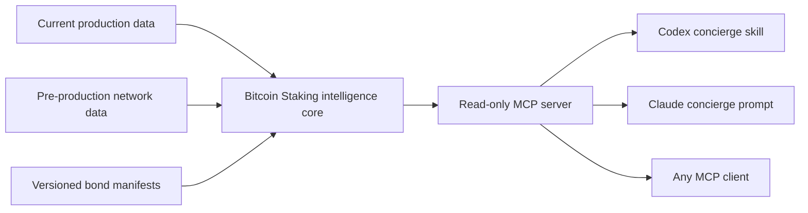

# Bitcoin Staking MCP

The agent-readable interface for discovering, understanding, and planning native Bitcoin staking on Stacks.

Bitcoin Staking MCP combines current PoX state, on-chain protocol-bond discovery, a live versioned bond and custody registry, deterministic route-aware scenarios, sourced security diligence, compatibility evidence, and a guided concierge. It is intentionally read-only: it cannot construct, sign, or broadcast transactions.

## Why this exists

Bitcoin staking crosses Bitcoin L1, Stacks, wallets, custodians, economic assumptions, and product-specific enrollment rules. Agents need structured facts and explicit uncertainty—not another generic FAQ bot.

This server keeps four kinds of information separate:

- `live`: current chain or API state;
- `published`: public documentation or product metadata;
- `derived`: deterministic calculations or fit assessments;
- `demo`: synthetic hackathon data that is never presented as available capital infrastructure.

## Architecture



The intelligence core contains schemas, provenance, economics, compatibility, and recommendation rules. It has no LLM dependency. The concierge is a thin workflow over MCP tools, not a separate service.

The concierge is an approachable Bitcoin Staking guide with institutional-quality diligence. It leads with the closest route, explains what is upcoming versus live, and turns pending terms into a practical preparation plan.

The answer policy is evidence-gated. The concierge may use only current MCP structured output and MCP resources for factual claims. It does not complete missing answers from model memory, infer wallet support from protocol behavior, treat an audit statement as end-to-end wallet proof, or substitute demo data after a live-read failure. When the corpus cannot answer a question, it says: “This MCP does not currently verify that,” and identifies the missing evidence.

The published product registry supplies the Genesis Bond's current schedule, reward cycle, and economic evidence at runtime. Scout keeps planned product timing, public reference-model assumptions, bond-specific terms, and final on-chain configured terms distinct. Yield scenarios use sourced rate and duration inputs plus current CoinGecko prices for paired-STX calculations. When an applicable fee is missing, the supported gross projection remains available and net yield remains unknown.

## Quick start

Requires Node 22.

Install for both Codex and Claude Code from any directory:

```bash
npx -y github:andre-stacks/bitcoin-staking-mcp#v0.3.0 setup
```

The installer performs a real MCP handshake, registers `bitcoin-staking` in the user-level configuration for both hosts, installs the global Codex concierge skill, and prints the first prompts. Restart both hosts after setup, then verify at any time:

```bash
npx -y github:andre-stacks/bitcoin-staking-mcp#v0.3.0 check
```

To install only one host, use `--hosts codex` or `--hosts claude`. See [Installation](docs/INSTALLATION.md) for local-checkout, pinned-source, JSON, update, and uninstall options.

### First conversation

Open `$bitcoin-staking-concierge` in Codex or `/mcp__bitcoin_staking__bitcoin_staking_concierge` in Claude Code. With no question attached, or with a broad statement such as “I'd like to get started with Bitcoin staking,” Scout introduces itself as the Bitcoin Staking Concierge, summarizes how it can help, and offers three useful starter questions. It does not make users learn bond routes before choosing a direction.

Ask naturally. For example:

```text
When is the next bond launching?
How can I get started staking?
Which participation option is right for me?
```

A specific first question bypasses general onboarding and proceeds directly to the relevant evidence-backed workflow.

The single concierge command is the user-facing entry point. Fourteen read-only MCP tools remain directly available to agents, developers, and MCP Inspector; users do not need to know their names.

For repository development:

```bash
npm ci
npm run check
npm start
```

For development:

```bash
npm run dev
```

### Live data selection

Users do not need to choose a network. For a general opportunity or diligence question, the concierge:

1. checks verified mainnet state and published bond data;
2. uses that data when an opportunity is available;
3. otherwise checks the configured testnet automatically for protocol-only pre-production evidence;
4. uses demo data only when the user explicitly requests an illustration.

This routing keeps the user experience stable: when a bond becomes published or available on mainnet, higher-precedence production data replaces the testnet preview without requiring different questions or prompts.

The current live demo source is Hiro's dedicated PoX-5 testnet at `https://api.testnet-pox5.hiro.so`. Before activation, the server reports the activation schedule rather than inventing a bond. After activation, it returns only bonds proven on-chain and labels them `live_testnet_demo`. Testnet uses test assets and is not a mainnet opportunity. On-chain configuration alone never implies product routes, profile fit, custody support, enrollment, or usable economics; those require a current owner-reviewed product manifest.

For a complete state-aware proof—current status, opportunity routing, security evidence, explicit demo data, no-match journey, and tool annotations—run:

```bash
npm run demo:proof
```

The environment variables in `.env.example` can override the endpoint or chain ID for another compatible test network.

### Codex

The repository includes `.codex/config.toml` and the repo-scoped `$bitcoin-staking-concierge` skill. Build the project, trust/open the repository in Codex, restart if needed, and inspect `/mcp`.

Manual configuration:

```bash
codex mcp add bitcoin-staking -- node /absolute/path/to/bitcoin-staking-mcp/dist/cli.js serve
```

Then ask:

```text
$bitcoin-staking-concierge I want yield, must keep BTC on Bitcoin L1, and can lock for six months.
```

### Claude Code

The repository includes `.mcp.json`. Build the project, open Claude Code in the repository, approve the project MCP configuration, and verify:

```bash
claude mcp list
```

Invoke the server prompt:

```text
/mcp__bitcoin_staking__bitcoin_staking_concierge
```

### MCP Inspector

```bash
npx @modelcontextprotocol/inspector node dist/cli.js serve
```

Use Inspector to review the instructions, all tool schemas and annotations, resources, prompt, valid calls, and error cases.

## Tools

| Tool | Purpose |
| --- | --- |
| `get_market_snapshot` | Load the reviewed bond, route, custody, and live-protocol front door. |
| `get_protocol_status` | Read current PoX-5 and reward-cycle state. |
| `list_protocol_bonds` | Discover configured on-chain bonds in the active mainnet or testnet window. |
| `get_security_guidance` | Answer audit, timelock, Leather, validation, recovery, and early-exit questions with evidence boundaries. |
| `build_diligence_report` | Combine live status, a verified protocol bond if present, profile fit, exact PoX-5 target math, and security evidence. |
| `list_bonds` | List public manifests and optionally separate demo records. |
| `list_custody_paths` | List current product-level custody paths, explicit non-support, and review freshness. |
| `list_bond_participation_routes` | Explain the direct native-L1 and current pool-based routes, including any registry-published LST capability. |
| `get_bond` | Read one normalized manifest and optional on-chain verification. |
| `check_participant_status` | Read public Stacks staking and bond state. |
| `check_compatibility` | Check cited wallet or custodian support; preserve unknowns. |
| `simulate_yield` | Fetch current CoinGecko BTC/STX prices and calculate gross yield plus paired STX units. |
| `compare_staking_paths` | Compare direct native-L1 and current pool-based routes for a participant profile, including any registry-published LST considerations. |
| `build_participation_plan` | Produce fit, tradeoffs, gaps, and safe next steps. |

Resources expose the capability catalog, glossary, yield methodology, bond manifests, and source records under `bitcoin-staking://` URIs.

`bitcoin-staking://capabilities` maps the user-facing services to all fourteen MCP tools and exposes the server, contract, and skill versions.

`bitcoin-staking://custody-paths` exposes the maintained native-L1 Bitcoin Staking custody directory. It is deliberately separate from bond manifests: a provider can have a product integration path even when no bond is open, while exact compatibility for a particular bond still requires manifest evidence.

Bond route details come from `list_bond_participation_routes`, which keeps direct and approved pooled paths attached to their bond and nests each optional LST capability under the pool that issues it.

`bitcoin-staking://security` exposes the complete security-diligence catalog. Security answers always distinguish published assurance, protocol/source behavior, SDK construction, wallet behavior, and end-to-end integration proof.

`bitcoin-staking://methodology/sources` exposes the source hierarchy and known corpus gaps. `bitcoin-staking://methodology/response-standard` exposes the institutional persona, audience adaptation, evidence language, and response contract.

## Example prompts

```text
What is the current Bitcoin Staking protocol status, and are any public bonds available?
```

```text
Which Bitcoin staking opportunities are currently available or coming next? Separate investable opportunities from pre-production data.
```

```text
Using the current public reference model, assess the gross reward scenario for 25 BTC. If an applicable fee is missing, keep net reward unknown, and separate model assumptions from bond-specific and final configured terms.
```

```text
Build an institutional diligence report using the best currently available data. I have 1 BTC, require Bitcoin L1, want control of the maturity key, use Leather, and can lock for six months.
```

```text
Has PoX-5 been audited, how is the Bitcoin timelock constructed, and what must I verify before signing the Leather transaction?
```

```text
Include demo opportunities. I have 1 BTC, want native-L1 yield, control my keys, and can lock for 180 days. Show the assumptions and sources.
```

```text
I want to borrow without selling and need access to my Bitcoin at any time. Compare the direct native-L1 route and current pool-based routes, including an LST only if redemption, liquidity, and a named lender are verified.
```

## Demo-data disclosure

`data/bonds/demo-native-bitcoin-bond.json` is synthetic. Its capacity, rate, fee, duration, eligibility, and compatibility fields are illustrative hackathon inputs. It has no on-chain bond index and is not open, published, investable, or available for enrollment.

Demo manifests:

- must carry `dataStatus: "demo"` and a demo source;
- are excluded by default;
- appear only in the separate `demoBonds` array when `includeDemo: true`;
- never override live or published data.

## Validation

```bash
npm run typecheck
npm test
npm run build
npm run test:live
npm run test:testnet
npm run demo:proof
```

The default tests are offline. The mainnet and configured-testnet tests are opt-in and read current public chain state. The checked-in concierge skill also passes the `skill-creator` quick validator. No command constructs or broadcasts a transaction.

The offline suite invokes all fourteen tools through an in-process MCP client, validates complete output contracts, checks registry caching and freshness, exercises the two route journeys and upstream failures, and tests the shared prompt/skill evidence contract. Prompt controls materially reduce unsupported answers, but callers should treat returned provenance and explicit unknown states as the enforceable trust boundary.

The bond, route, LST, and custody registries use a deliberate hard seven-day owner-review cadence. `reviewDueAt` provides the warning boundary; immediately after that boundary, claims remain visible only as historical context and cannot support a current route or bundled fallback. There is no runtime grace period. `npm run registry:validate` validates schemas, references, formats, duplicates, and status-specific fields while reporting overdue attestations as `needs_review`; `npm run registry:validate:live` requires current attestations and also checks external evidence URLs. A nightly GitHub Actions workflow opens or updates one `registry-review-due` issue when live validation fails. The check never promotes a partner automatically: changed or stale claims require product-owner confirmation through a reviewed registry PR. Registry authenticity currently relies on GitHub transport, repository controls, review history, and the reported content hash; signed manifests are not yet implemented.

## Documentation

- [Product requirements](docs/PRODUCT_REQUIREMENTS.md)
- [Installation](docs/INSTALLATION.md)
- [Technical specification](docs/TECHNICAL_SPEC.md)
- [Hackathon delivery plan](docs/HACKATHON_PLAN.md)
- [Security question catalog](docs/SECURITY_QUESTION_CATALOG.md)
- [Institutional response standard](docs/INSTITUTIONAL_RESPONSE_STANDARD.md)
- [Canonical source corpus](docs/SOURCE_CORPUS.md)
- [Hackathon demo runbook](docs/DEMO_RUNBOOK.md)
- [Implementation audit](docs/IMPLEMENTATION_AUDIT.md)
- [User experience review](docs/UX_REVIEW.md)

## Roadmap

1. Read-only MCP and public bond manifests.
2. Dedicated concierge UI and additional verified data adapters.
3. Operator/BD intelligence and unmet-demand reporting.
4. Separately approved, human-reviewed transaction preparation.

## Safety boundary

This is experimental informational software, not financial advice. Verify every opportunity, wallet path, custody arrangement, economic assumption, and transaction through its authoritative source before committing capital.
