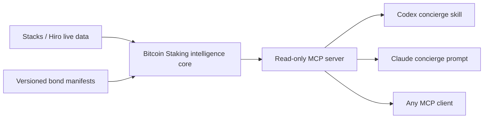

# Bitcoin Staking MCP

The agent-readable interface for discovering, understanding, and planning native Bitcoin staking on Stacks.

Bitcoin Staking MCP combines live PoX-5 state, versioned bond manifests, deterministic yield scenarios, compatibility evidence, and a goal-first concierge. It is intentionally read-only: it cannot construct, sign, or broadcast transactions.

## Why this exists

Bitcoin staking crosses Bitcoin L1, Stacks, wallets, custodians, economic assumptions, and product-specific enrollment rules. Agents need structured facts and explicit uncertainty—not another generic FAQ bot.

This server keeps four kinds of information separate:

- `live`: current chain or API state;
- `published`: public documentation or product metadata;
- `derived`: deterministic calculations or fit assessments;
- `demo`: synthetic hackathon data that is never presented as available capital infrastructure.

## Architecture



The intelligence core contains schemas, provenance, economics, compatibility, and recommendation rules. It has no LLM dependency. The concierge is a thin workflow over MCP tools, not a separate service.

## Quick start

Requires Node 22.

```bash
npm ci
npm run check
npm start
```

For development:

```bash
npm run dev
```

### Codex

The repository includes `.codex/config.toml` and the repo-scoped `$bitcoin-staking-concierge` skill. Build the project, trust/open the repository in Codex, restart if needed, and inspect `/mcp`.

Manual configuration:

```bash
codex mcp add bitcoin-staking -- node /absolute/path/to/bitcoin-staking-mcp/dist/stdio.js
```

Then ask:

```text
$bitcoin-staking-concierge I want yield, must keep BTC on Bitcoin L1, and can lock for six months.
```

### Claude Code

The repository includes `.mcp.json`. Build the project, open Claude Code in the repository, approve the project MCP configuration, and verify:

```bash
claude mcp list
```

Invoke the server prompt:

```text
/mcp__bitcoin_staking__bitcoin_staking_concierge
```

### MCP Inspector

```bash
npx @modelcontextprotocol/inspector node dist/stdio.js
```

Use Inspector to review the instructions, all tool schemas and annotations, resources, prompt, valid calls, and error cases.

## Tools

| Tool | Purpose |
| --- | --- |
| `get_protocol_status` | Read current PoX-5 and reward-cycle state. |
| `list_bonds` | List public manifests and optionally separate demo records. |
| `get_bond` | Read one normalized manifest and optional on-chain verification. |
| `check_participant_status` | Read public Stacks staking and bond state. |
| `check_compatibility` | Check cited wallet or custodian support; preserve unknowns. |
| `simulate_yield` | Run deterministic rate, fee, and price scenarios. |
| `compare_staking_paths` | Compare native-L1 staking with sourced sBTC context. |
| `build_participation_plan` | Produce fit, tradeoffs, gaps, and safe next steps. |

Resources expose the glossary, yield methodology, bond manifests, and source records under `bitcoin-staking://` URIs.

## Example prompts

```text
What is the current Bitcoin Staking protocol status, and are any public bonds available?
```

```text
Include demo opportunities. I have 1 BTC, want native-L1 yield, control my keys, and can lock for 180 days. Show the assumptions and sources.
```

```text
I want to borrow without selling and need access to my Bitcoin at any time. Compare the native Bitcoin staking path with sBTC context without recommending an unverified product.
```

## Demo-data disclosure

`data/bonds/demo-native-bitcoin-bond.json` is synthetic. Its capacity, rate, fee, duration, eligibility, and compatibility fields are illustrative hackathon inputs. It has no on-chain bond index and is not open, published, investable, or available for enrollment.

Demo manifests:

- must carry `dataStatus: "demo"` and a demo source;
- are excluded by default;
- appear only in the separate `demoBonds` array when `includeDemo: true`;
- never override live or published data.

## Validation

```bash
npm run typecheck
npm test
npm run build
npm run test:live
```

The default tests are offline. The live test is opt-in and reads current public PoX state. The checked-in concierge skill also passes the `skill-creator` quick validator. No command constructs or broadcasts a transaction.

## Documentation

- [Product requirements](docs/PRODUCT_REQUIREMENTS.md)
- [Technical specification](docs/TECHNICAL_SPEC.md)
- [Hackathon delivery plan](docs/HACKATHON_PLAN.md)

## Roadmap

1. Read-only MCP and public bond manifests.
2. Dedicated concierge UI and additional verified data adapters.
3. Operator/BD intelligence and unmet-demand reporting.
4. Separately approved, human-reviewed transaction preparation.

## Safety boundary

This is experimental informational software, not financial advice. Verify every opportunity, wallet path, custody arrangement, economic assumption, and transaction through its authoritative source before committing capital.
