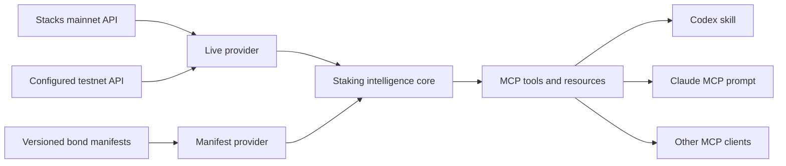

# Bitcoin Staking MCP — Technical Specification

## Architecture



The TypeScript core has no model dependency and is not a separately deployed service. The stdio server constructs a new MCP instance per connection. Remote Streamable HTTP is deferred.

## Runtime and dependencies

- Node 22, ESM, TypeScript 5.9, and Zod 4.
- `@modelcontextprotocol/server` 2.0.0 for MCP v2 with legacy-client support.
- `@stacks/bitcoin-staking` 7.6.0 for PoX-5 reads.
- `@stacks/network` and `@stacks/transactions` 7.6.0 for network and address validation.
- All package versions are pinned in `package-lock.json`.

## Core schemas

`BondManifestV2` contains shared bond identity, lifecycle, network, optional on-chain bond index, timing, economics, protocol controls, sources, and exactly the owner-approved participation routes. Routes are a discriminated union of native-L1 direct participation and an approved sBTC pool; an LST is nested only as an optional pool capability. V1 manifests normalize to one unconfirmed native-L1 route.

`ParticipantProfile` contains goal, liquidity requirement, Bitcoin/sBTC preference, key-control preference, optional wallet or custodian, BTC amount, and horizon.

`RecommendationResult` contains fit, reasons, tradeoffs, missing facts, unsupported requirements, alternatives, next steps, data status, sources, assumptions, and verification time.

Yield output contains principal, duration, annual rate, fee, reward model, gross/net result, price scenarios, and derivation metadata. BigInts become decimal strings at the MCP boundary.

## Provenance and source precedence

Each successful tool result includes:

- `dataStatus`: `live`, `published`, `derived`, or `demo`.
- `sources`: absolute URL, title, type, source status, and optional retrieval time.
- `assumptions`: calculation and interpretation boundaries.
- `verifiedAt`: time the result was assembled.

Precedence is live chain/API data, published public documentation, versioned public manifests, then demo manifests. The server never merges a demo field into live chain state. Demo records require a demo source, are excluded by default, and appear only in `demoBonds` when requested.

Within public evidence, protocol behavior follows a stricter hierarchy: live/deployed state; release-pinned contracts and reference implementations; accepted SIP-045; release-pinned SDK/tests; current operator/developer docs; public assurance; manifests; demo data. Conflicts are surfaced rather than silently reconciled in favor of lower-precedence prose.

## Providers

The Stacks provider uses `STACKS_API_BASE_URL` for mainnet and `BITCOIN_STAKING_TESTNET_API_BASE_URL` plus `BITCOIN_STAKING_TESTNET_CHAIN_ID` for the testnet target. Mainnet defaults to Hiro mainnet; testnet defaults to Hiro's dedicated PoX-5 testnet at `https://api.testnet-pox5.hiro.so`. It reads PoX information, derives prepare and reward phase heights from returned cycle constants, checks optional bond indices, scans a bounded active bond window, and reads participant state. Requests are bounded by `BITCOIN_STAKING_UPSTREAM_TIMEOUT_MS`.

Testnet is never assumed to have activated PoX-5 merely because of its hostname. The provider reads `contract_versions` and exposes the scheduled PoX-5 activation height, first reward cycle, and blocks remaining. `list_protocol_bonds` requires `/v2/pox` to report an active `.pox-5` contract before reading bonds. It then derives the current bond period, scans the six-period active lookback plus two future periods by default, and returns only indices whose `get-protocol-bond` read proves on-chain configuration. Testnet records carry `availability: live_testnet_demo`: they describe the working prototype environment and never a mainnet opportunity.

The manifest provider reads and validates every JSON file in `data/bonds`. Duplicate IDs, invalid URLs, invalid data-status combinations, and incomplete fixed-unit reward models fail closed.

Each compatibility claim must cite at least one source ID contained in the same manifest. Manifest-backed on-chain and participant reads route through the provider for that manifest's network; a testnet manifest cannot silently query mainnet. Live verification sources are appended without overwriting manifest provenance.

## MCP interfaces

Fourteen tools are registered:

- `get_protocol_status`
- `list_protocol_bonds`
- `get_security_guidance`
- `build_diligence_report`
- `list_bonds`
- `list_custody_paths`
- `get_market_snapshot`
- `list_bond_participation_routes`
- `get_bond`
- `check_participant_status`
- `check_compatibility`
- `simulate_yield`
- `compare_staking_paths`
- `build_participation_plan`

All declare read-only and non-destructive annotations. Live network tools additionally declare open-world behavior. Inputs and successful outputs are Zod-validated. Errors return `INVALID_INPUT`, `NOT_FOUND`, `INSUFFICIENT_DATA`, `UPSTREAM_ERROR`, or `UPSTREAM_TIMEOUT`, plus a retryable flag.

Resources:

- `bitcoin-staking://capabilities`
- `bitcoin-staking://glossary`
- `bitcoin-staking://methodology/yield`
- `bitcoin-staking://security`
- `bitcoin-staking://custody-paths`
- `bitcoin-staking://methodology/sources`
- `bitcoin-staking://methodology/response-standard`
- `bitcoin-staking://bonds/{bondId}`
- `bitcoin-staking://sources/{sourceId}`

The `bitcoin-staking-concierge` prompt contains workflow instructions, not registry facts or math. On an empty invocation it calls the market snapshot, introduces the two bond-scoped routes, and asks one priority question. When a request is supplied it proceeds directly. Codex also discovers `.agents/skills/bitcoin-staking-concierge` and uses the same behavior and tool sequence. `bitcoin-staking://capabilities` maps all fourteen tools and exposes contract, server, and skill versions.

The prompt, MCP server instructions, and skill share one institutional response contract. CFO/investment questions lead with availability, custody, liquidity, economics, and material risk. Technical/security/custody questions lead with mechanisms, component boundaries, deterministic verification, and pinned sources. Mixed questions receive a short executive conclusion followed by compact technical evidence.

For generic opportunity and diligence requests, the orchestration layer hides network selection from the user. It queries mainnet state and published manifests first. Only when neither supplies an available opportunity does it inspect the configured testnet as the `live_testnet_demo` prototype environment for the intended mainnet journey. Verified mainnet or published opportunity data always takes precedence, so production rollout does not require new user prompts. Demo manifests are never selected automatically.

The versioned custody registry in `data/custody-paths.json` is product-level rather than bond-level. It distinguishes available, not-currently-supported, in-integration, and unknown paths; records a review cadence and verification method; and cites its sources. The scheduled `custody-registry-review` workflow validates freshness and source reachability every week. It flags review work but never changes a partner's status automatically.

The upcoming Genesis manifest contains a versioned `reference_program_model` sourced to the public Protocol Bonds dashboard. It records a 3% BTC target APY, 5% minimum STX value ratio, 12-cycle (~174-day) reference period, 3,000 BTC initial modeled capacity, and 1.5× target coverage ratio. `simulate_yield` uses a configured duration or the sourced reference period and refuses when duration, rate, route fee, or a selected LST fee is incomplete. It may enrich complete scenarios with cached CoinGecko BTC and STX prices; explicit prices override live observations and price failure does not block deterministic reward sats. Every result labels model assumptions separately from final configured bond terms.

That response contract is evidence-gated. Current MCP structured output and resources are the only factual input. Missing evidence produces the fixed abstention “This MCP does not currently verify that,” plus the evidence required to answer. Live-read failure cannot be replaced with demo, stale, or remembered state. Unknown and empty results remain unknown and empty. This policy is duplicated deliberately in server instructions, the MCP prompt, the response-standard resource, and the repo skill, and is guarded by contract tests.

Security guidance is a versioned deterministic corpus in `src/security.ts`. Topics return an answer, evidence level, known facts, unproven claims, verification checklist, and pinned source IDs. The source set includes the official public audit statement, SIP-045, pinned PoX-5 and Stacks.js code, golden-vector tests, and pinned Leather RPC implementations. Investor chats affect topic coverage only; they are not stored as evidence.

`build_diligence_report` is a deterministic composition layer. It has scheduled-activation, no-configured-bond, and configured-bond branches. The configured branch derives the minimum paired uSTX and target sBTC reward from the live bond tuple, preserves wallet compatibility as unknown, and states that the reward pool can cap actual payout.

## Economics

For BTC/sBTC target-rate manifests:

```text
gross sats = floor(principal sats × annual rate bps × days ÷ 10,000 ÷ 365)
fee sats   = floor(gross sats × fee bps ÷ 10,000)
net sats   = gross sats − fee sats
```

The model is simple and non-compounding. STX price scenarios do not alter BTC- or sBTC-denominated reward sats. Fixed STX reward models require a manifest-provided unit quantity. Unknown or incompatible reward models return `INSUFFICIENT_DATA`.

For live PoX-5 protocol bonds, the target scenario mirrors the contract calculation: `floor(floor(principal sats × target-rate bps ÷ 10,000) ÷ 50)` sBTC sats per reward calculation. Annualized target sats multiply that rounded value by 50. Actual earned rewards can be lower when available rewards do not cover the target. The minimum paired uSTX mirrors `min-ustx-for-sats-amount` using the live `stx-value-ratio` and `min-ustx-ratio`.

## Host configuration

The checked-in `.codex/config.toml` starts `node dist/stdio.js` and the repo-scoped skill is available after the project is trusted. `.mcp.json` provides the equivalent Claude Code project configuration. Build before opening either host.

For cross-repository use, `dist/cli.js` is the package binary. `setup` verifies the exact fourteen-tool contract, server/contract/skill versions, registry version/hash/freshness, and selected hosts. It autodetects Codex and Claude, skips absent default hosts, fails for an absent explicitly requested host, and installs a hashed concierge skill. `update` repeats the safe registration flow. `uninstall` removes only the named registrations and skill. The portable default pins `#v0.3.0`; unpinned `main` is development-only.

Claude exposes the MCP prompt as `/mcp__bitcoin_staking__bitcoin_staking_concierge`. Codex invokes `$bitcoin-staking-concierge`; both use the same MCP tools.

## Testing

The default suite is offline. It covers v1 normalization, v2 route schemas, attestations and freshness, ETag/cache/fallback behavior, deterministic route fees and incomplete-economics refusal, participant journeys, network conflicts and provenance, invocation of all fourteen tools, read-only annotations, installer integrity checks, and targeted uninstall behavior.

`npm run test:live` performs the opt-in mainnet PoX smoke test. `npm run test:testnet` verifies that the dedicated testnet publishes either scheduled or active PoX-5 state; after activation, any returned bonds must remain explicitly labeled as live testnet demos. `npm run check` runs type checking, offline tests, and a production build.

No test constructs or broadcasts a transaction.

The deterministic server can enforce schemas, provenance, failure behavior, and absence of transaction capabilities. It cannot guarantee that an arbitrary host model will always obey a natural-language instruction. Host acceptance therefore includes adversarial prompts that request guessing, unsupported safety claims, and demo fallback; expected behavior is explicit abstention or a sourced, bounded answer.
