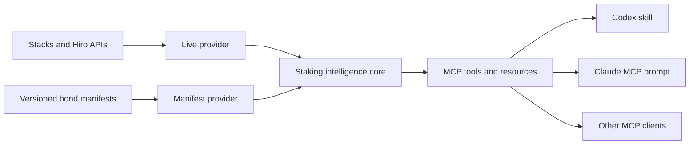

# Bitcoin Staking MCP — Technical Specification

## Architecture



The TypeScript core has no model dependency and is not a separately deployed service. The stdio server constructs a new MCP instance per connection. Remote Streamable HTTP is deferred.

## Runtime and dependencies

- Node 22, ESM, TypeScript 5.9, and Zod 4.
- `@modelcontextprotocol/server` 2.0.0 for MCP v2 with legacy-client support.
- `@stacks/bitcoin-staking` 7.6.0 for PoX-5 reads.
- `@stacks/network` and `@stacks/transactions` 7.6.0 for network and address validation.
- All package versions are pinned in `package-lock.json`.

## Core schemas

`BondManifest` contains identity, lifecycle, network, optional on-chain bond index, native-L1 participation path, timing, economics, capacity, requirements, compatibility claims, notes, sources, and verification time.

`ParticipantProfile` contains goal, liquidity requirement, Bitcoin/sBTC preference, key-control preference, optional wallet or custodian, BTC amount, and horizon.

`RecommendationResult` contains fit, reasons, tradeoffs, missing facts, unsupported requirements, alternatives, next steps, data status, sources, assumptions, and verification time.

Yield output contains principal, duration, annual rate, fee, reward model, gross/net result, price scenarios, and derivation metadata. BigInts become decimal strings at the MCP boundary.

## Provenance and source precedence

Each successful tool result includes:

- `dataStatus`: `live`, `published`, `derived`, or `demo`.
- `sources`: absolute URL, title, type, source status, and optional retrieval time.
- `assumptions`: calculation and interpretation boundaries.
- `verifiedAt`: time the result was assembled.

Precedence is live chain/API data, published public documentation, versioned public manifests, then demo manifests. The server never merges a demo field into live chain state. Demo records require a demo source, are excluded by default, and appear only in `demoBonds` when requested.

## Providers

The Stacks provider uses the configured `STACKS_API_BASE_URL`, defaulting to Hiro mainnet. It reads PoX information, derives prepare and reward phase heights from returned cycle constants, checks optional bond indices, and reads participant state. Requests are bounded by `BITCOIN_STAKING_UPSTREAM_TIMEOUT_MS`.

The manifest provider reads and validates every JSON file in `data/bonds`. Duplicate IDs, invalid URLs, invalid data-status combinations, and incomplete fixed-unit reward models fail closed.

## MCP interfaces

Eight tools are registered:

- `get_protocol_status`
- `list_bonds`
- `get_bond`
- `check_participant_status`
- `check_compatibility`
- `simulate_yield`
- `compare_staking_paths`
- `build_participation_plan`

All declare read-only and non-destructive annotations. Live network tools additionally declare open-world behavior. Inputs and successful outputs are Zod-validated. Errors return `INVALID_INPUT`, `NOT_FOUND`, `INSUFFICIENT_DATA`, `UPSTREAM_ERROR`, or `UPSTREAM_TIMEOUT`, plus a retryable flag.

Resources:

- `bitcoin-staking://glossary`
- `bitcoin-staking://methodology/yield`
- `bitcoin-staking://bonds/{bondId}`
- `bitcoin-staking://sources/{sourceId}`

The `bitcoin-staking-concierge` prompt contains workflow instructions, not facts or math. Codex also discovers `.agents/skills/bitcoin-staking-concierge` and uses the same tool sequence.

## Economics

For BTC/sBTC target-rate manifests:

```text
gross sats = floor(principal sats × annual rate bps × days ÷ 10,000 ÷ 365)
fee sats   = floor(gross sats × fee bps ÷ 10,000)
net sats   = gross sats − fee sats
```

The model is simple and non-compounding. STX price scenarios do not alter BTC-denominated reward sats. Fixed STX reward models require a manifest-provided unit quantity. Unknown or incompatible reward models return `INSUFFICIENT_DATA`.

## Host configuration

The checked-in `.codex/config.toml` starts `node dist/stdio.js` and the repo-scoped skill is available after the project is trusted. `.mcp.json` provides the equivalent Claude Code project configuration. Build before opening either host.

Claude exposes the MCP prompt as `/mcp__bitcoin_staking__bitcoin_staking_concierge`. Codex invokes `$bitcoin-staking-concierge`; both use the same MCP tools.

## Testing

The default suite is offline. It covers manifest validation, demo isolation, BigInt conversion, math, fees, missing economics, compatibility, path classification, recommendations, timeout behavior, MCP discovery/calls, resources, prompts, annotations, and fail-fast address validation.

`npm run test:live` performs the opt-in mainnet PoX smoke test. `npm run check` runs type checking, offline tests, and a production build.

No test constructs or broadcasts a transaction.
